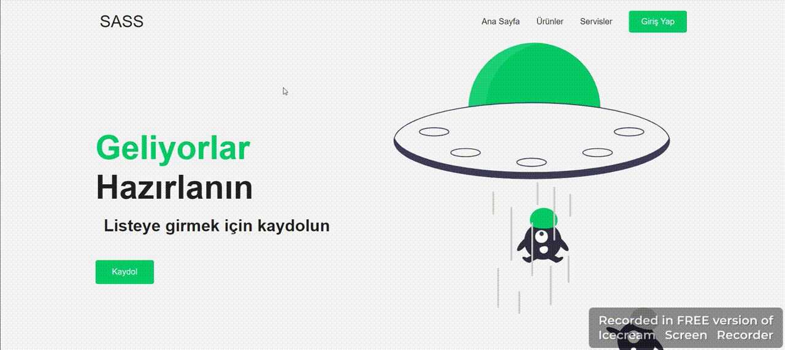

<h1> SASS-2 </h1>

This study is an educational project prepared using Sass and Scss. The project is developed with clear coding methods, avoiding code repetition.

<h2>Tecnologies Used</h2>

HTML, CSS, SASS, SCSS.

<h2>Ekran</h2>

